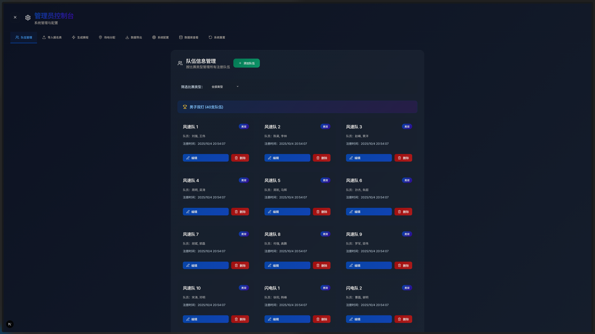
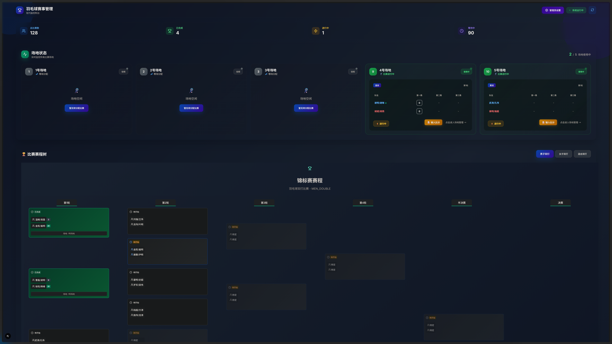
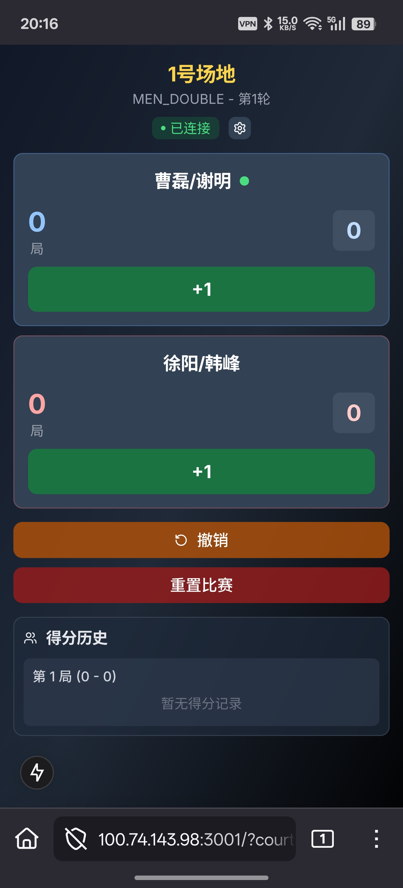

# 🏸 智能羽毛球赛事管理系统
### Professional Badminton Tournament Management Platform

<div align="center">

[](https://www.typescriptlang.org/)
[](https://nextjs.org/)
[](https://socket.io/)
[](https://www.prisma.io/)

**🎯 专业级羽毛球比赛全流程数字化解决方案**

*从赛事策划到颁奖典礼，一站式智能管理平台*

</div>

---

## 📷 系统演示

| 📋 赛事准备 | 🎯 比赛管理 | 📱 移动端操作 |
|:---:|:---:|:---:|
| [] | []| []|

---

## 🏆 核心功能

### ⚡ 智能赛制管理
- 📊 **可视化对阵图** - 实时更新的淘汰赛树状图
- 🎯 **灵活赛制** - 单淘汰、双淘汰等多种赛制
- 🏆 **决赛特殊标识** - 金色主题，专属奖杯徽章
- 🥉 **铜牌赛支持** - 第三名争夺战，完整奖牌体系


### 📱 多端协同
- 🖥️ **Web主控台** - 全局管理和监控
- 📱 **移动场地管理器** - 现场快速操作
- 🔄 **实时同步** - WebSocket毫秒级数据同步

### 🎮 用户体验
- 🎨 直观的可视化界面
- ⚡ 一键操作流程
- 🛡️ 数据安全保障

---

## 🚄 快速开始

### 环境要求
- Node.js 18+
- pnpm 8+

### 安装运行
```bash
# 克隆项目
git clone https://github.com/ntb666/badminton-tournament-manager.git
cd badminton-tournament-manager

# 安装依赖
pnpm install

# 初始化数据库
cd apps/api && npx prisma migrate dev
cd ../..

# 启动项目
pnpm run dev
```

### 访问地址
- 🖥️ **Web主控台**: http://localhost:3000
- 📱 **场地管理器**: http://localhost:3001  
- 🔧 **API服务**: http://localhost:4001

---

## 📱 使用流程

1. **导入队伍** - CSV批量导入或手动添加
2. **配置赛制** - 选择赛制类型，启用铜牌赛
3. **生成赛程** - 自动生成对阵表
4. **分配场地** - 拖拽式场地分配
5. **实时计分** - 移动端快速录入比分
6. **查看结果** - 生成成绩单和统计报告

---

## 🛠️ 技术栈

### 前端
- **Next.js 15** - React全栈框架
- **TypeScript** - 类型安全
- **Tailwind CSS** - 原子化CSS

### 后端  
- **Node.js + Express** - API服务器
- **Prisma + SQLite** - 数据库ORM
- **Socket.IO** - 实时通信

---

**⭐ 如果这个项目对你有帮助，请给我们一个Star！ ⭐**

